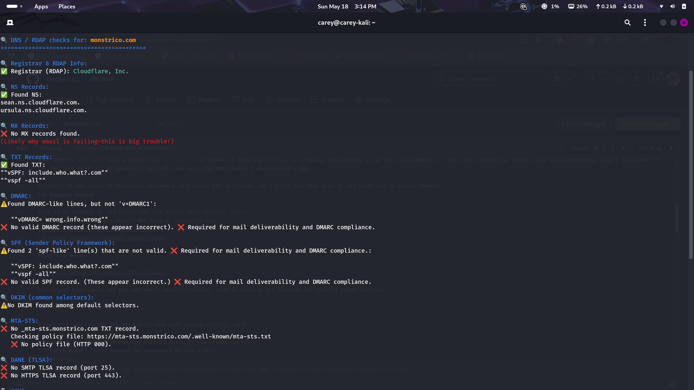
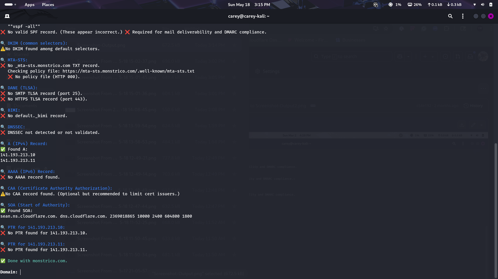
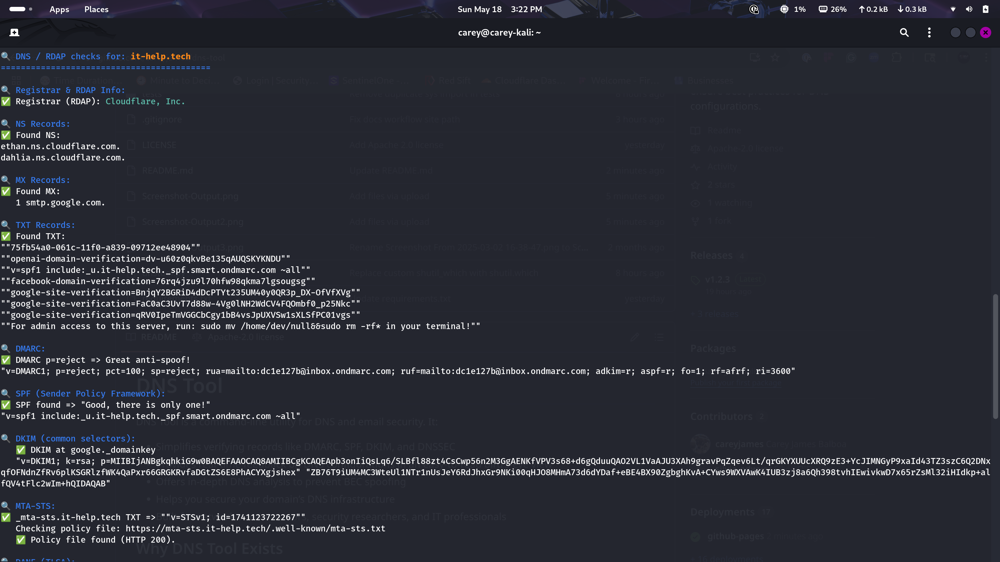

# DNS Tool

DNS Tool is a command-line utility for DNS and email security. It:
- Simplifies verifying records like DMARC, SPF, DKIM, and DNSSEC
- Provides real-time feedback on DNS configurations in an easy-to-read bird’s-eye view
- Offers in-depth DNS analysis to prevent BEC spoofing
- Helps you secure your domain’s DNS infrastructure
- Built for network administrators, security researchers, and IT professionals

## Why DNS Tool Exists

I’ve always said:

> **“If your DMARC says p=none, your work’s not done—get to p=reject!”**

- Many domains still use `p=none`, which only reports spoofing.
- Enforcing `p=reject` blocks malicious emails.
- Full DNS security also requires verifying SPF, DKIM, DNSSEC, and MTA-STS.

Before I made this tool, I had to hop between several separate DNS tools:

- One for SPF lookups.
- Another for DMARC checks.
- A third for DKIM record validation.
- Another for DNSSEC, TLSA, CAA, and so forth.

It was time-consuming and error-prone, especially if I needed to see DNS changes “live” as they propagated. Checking each record across multiple tools became a daily routine of copying and pasting domain names.

## One Tool to Check Them All

That’s why **DNS Tool** (originally called **DNS Scout**) was born:

- A single script to see all key DNS records at once: **NS, A/AAAA, MX, TXT, SPF, DMARC, DKIM, DANE, BIMI, DNSSEC, CAA, SOA, PTR**—plus RDAP and a WHOIS fallback for registrar info.
- Colorful output to highlight missing records or outdated policies.
- Immediate feedback when you correct your DNS settings and re-run checks.

Now, whether I’m verifying a domain has `p=reject` for DMARC or ensuring MTA-STS is properly configured, I can run one command (or open one interactive prompt) and see everything. That’s the power of the DNS Tool, which was born out of necessity to unify the multiple DNS checks I perform every day.

In short, I was tired of switching between a half-dozen DNS utilities, so I built one that does it all with just a single command.
### Example Output

This is an example of the output you can expect when running `dnstool`:
A  purposefully horrible domain DNS record, monstrico.com



A Correct domain:



The output highlights key DNS and email security checks, such as missing SPF records and invalid DMARC policies.

#### DNS Tool (Python Edition)

A powerful, all-in-one DNS diagnostic and RDAP lookup utility, with:

- **Interactive Mode** (arrow-key history built-in via prompt_toolkit).
- **Batch Mode** (pass domains as arguments or via a file).
- Checks for:
  - NS, A/AAAA, MX, TXT, SPF, DMARC, DKIM, MTA-STS, DANE, BIMI, DNSSEC, CAA, SOA, PTR.
  - RDAP + WHOIS fallback for registrar info.
- Colorful output with ✅, ❌, ⚠️ to highlight issues and best-practice suggestions.

This tool bundles Python dependencies (dnspython, requests, etc.) into a **single binary** via PyInstaller—no separate Python install is needed.

---

##### Download & Run

Below is a summary of the release files and the systems they support.

| Release asset | Supported systems |
| ------------- | ----------------- |
| `dnstool-linux-amd64-glibc-<version>` | glibc-based x86-64 Linux (Kali, Debian, Ubuntu, Fedora on Intel/AMD hardware) |
| `dnstool-linux-arm64-glibc-<version>` | glibc-based ARM64 Linux (e.g., Debian/Ubuntu on ARM hardware) |
| `dnstool-macos-intel-<version>` | macOS on Intel processors |
| `dnstool-macos-silicon-<version>` | macOS on Apple Silicon |
| `dnstool-windows-amd64-<version>.exe` | Windows 10/11 64-bit |

###### Linux

1. **Download** the `dnstool-linux-amd64-glibc` binary (or `dnstool-linux-arm64-glibc` for ARM) from the [GitHub Releases](../../releases).
2. **Make the binary executable**:
   ```bash
   chmod +x dnstool
   ```
   Run the tool:
   ```bash
   ./dnstool
   ```
   Optional: Move the binary to a directory in your `PATH` (e.g., `/usr/local/bin`) to run it from anywhere:
   ```bash
   sudo mv dnstool /usr/local/bin
   ```
   Now, you should be able to run `dnstool` directly from any directory without having to prefix it with `./`.

####### macOS

- Download the `dnstool-macos-intel` binary (or `dnstool-macos-silicon` for Apple Silicon) from Releases.
- If Gatekeeper blocks it, you can:
  - **GUI method**
    - Right-click the file and choose Open.
    - When warned that the developer is unverified, click Open Anyway.
    - Or open System Preferences → Security & Privacy → General and click Allow Anyway.
  - **Terminal method**
    ```bash
    chmod +x dnstool-macos-*
    xattr -r -d com.apple.quarantine ./dnstool-macos-*
    ./dnstool-macos-*
    ```
- Arrow-key history and color output should work just like Linux.
######## Windows
Download the `dnstool-windows-amd64.exe` binary from Releases.
Run the .exe binary in Command Prompt / PowerShell:
```powershell
.\dnstool-windows-amd64.exe
```
- Because the binary is unsigned, Windows SmartScreen may warn that the publisher cannot be verified.
- Click "More info" and then "Run anyway" to continue.

######### Usage
Interactive Mode
Just run dnstool (or the .exe/macOS binary with no arguments):
```bash
./dnstool
```
You’ll see:
```text
Interactive Mode. Type a domain and press Enter to run checks immediately.
Type 'exit' or press Enter on a blank line to quit.
```


- Type any domain (e.g., `example.com`) and press Enter to run checks.
- DNS Tool displays color-coded results for NS, MX, SPF, DMARC, and more.
- Arrow keys recall previously typed domains thanks to `prompt_toolkit`.
- On macOS Terminal or Linux, you should see a bold "Domain:" prompt.
Batch Mode (Command-line arguments)
You can pass one or more domain names on the command line:

```bash
./dnstool example.com example.org
```
DNS Tool will run checks for each domain in turn.

Custom Resolvers
Specify one or more DNS resolvers with `--resolver` (can be repeated):

```bash
./dnstool --resolver 1.1.1.1 --resolver 8.8.8.8 example.com
```
If omitted, DNS Tool uses the default list `1.1.1.1`, `8.8.8.8`, and `9.9.9.9`.

Authoritative Lookups
Add `--authoritative` to bypass resolver caches and query the domain's authoritative nameservers directly.

```bash
./dnstool --authoritative example.com
```


File Input
Use -f <file> to read domains from a file (one domain per line):

```bash
./dnstool -f domains.txt
```
DNS Tool reads those domains and runs checks in sequence.

Verbose/Debug
Add -v to see debug messages:

```bash
./dnstool -v example.com
```
You’ll get extra [DEBUG] lines (like which RDAP endpoints it tries, DNS query timeouts, etc.).

######### Help/Usage
```bash
./dnstool -h
```
Prints a short usage message:
```text
usage: dnstool.py [-v] [-f file] [-r RESOLVER] [-a] [domain1 domain2 ...]
```
### Building From Source
If you don’t want to download the precompiled binaries, you can build it yourself:

Install Python 3.7+ (system-wide).
Clone this repo:
```bash
git clone https://github.com/<your-username>/dns-tool.git
cd dns-tool
```
Install dependencies in a virtual environment (versions pinned in `requirements.txt`):
```bash
python3 -m venv buildenv
source buildenv/bin/activate
 pip install pyinstaller \
   dnspython>=2.4,<3.0 \
   requests>=2.31,<3.0 \
   idna>=3.3,<4.0 \
   prompt_toolkit>=3.0,<4.0
```
Compile:
```bash
pyinstaller --onefile dnstool.py
```
The final binary is in dist/dnstool (or dnstool.exe on Windows).

### Running Tests

- Install the dependencies and `pytest`.
- Execute the test suite from the project root using `pytest`.

```bash
pytest
```

FAQ
1. Why is Windows complaining about an unknown publisher?

   - The .exe is not code-signed.
   - We do not currently have a code-signing certificate.
   - Click "More info" and then "Run anyway" to launch.

   - No code signing or notarization is available.
   - Use System Preferences → Security & Privacy → General → Open Anyway.
    - Or run `xattr -d com.apple.quarantine ./dnstool-macos-*`.


3. Does the Linux binary work on all distros?

   - Works on most recent distros with glibc matching our build environment.
   - On older systems you may see GLIBC errors; build from source.

4. Does arrow-key history require anything special?
   - No extra dependencies. `prompt_toolkit` is bundled in the binary.
   - Commands are saved to `~/.domain_history_rdap_interactive`.

License
This project is licensed under the Apache License 2.0. See the
[LICENSE](LICENSE) file for the full license text.

Contributing
Bug reports: Please open an Issue if you spot any problems or have feature requests.
Pull requests: Always welcome. Test on your OS (Linux, macOS, Windows) if possible.
