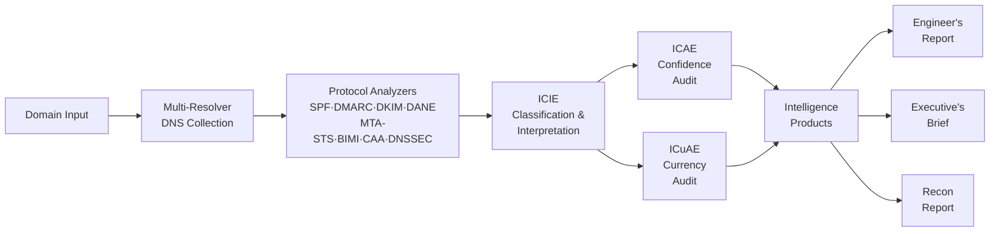

# DNS Tool — Domain Security Intelligence Platform
[](https://doi.org/10.5281/zenodo.18854899)
[](LICENSE)
[](https://sonarcloud.io/summary/new_code?id=ithelpsandiego_dns-tool-full)
[](https://sonarcloud.io/summary/new_code?id=ithelpsandiego_dns-tool-full)

> **Decision-ready intelligence, not just DNS data.**

DNS Tool is an RFC-compliant OSINT platform for domain security analysis, producing five distinct intelligence products covering email authentication (DMARC, SPF, DKIM), transport security (DANE, MTA-STS), and brand protection (BIMI, CAA).

**Live**: [dnstool.it-help.tech](https://dnstool.it-help.tech)

## What It Does

Enter a domain. Get security intelligence that answers questions like:

- **Can this domain be impersonated by email?** (DMARC/SPF/DKIM analysis)
- **Are spoofed emails rejected or quarantined?** (Policy enforcement)
- **Can attackers downgrade SMTP to intercept mail?** (MTA-STS/DANE)
- **Can DNS responses be tampered with in transit?** (DNSSEC chain validation)

Five Intelligence Products:
- **Engineer's DNS Intelligence Report** — comprehensive technical detail for security teams
- **Executive's DNS Intelligence Brief** — concise board-ready summary with security scorecard
- **Recon Report** — adversarial red-team perspective using Covert Recon Mode
- **Domain Dossier** — aggregated infrastructure and exposure intelligence view
- **Domain Comparison** — side-by-side security posture analysis

## Architecture


```mermaid
graph LR
    A["Domain Input"] --> B["Multi-Resolver<br/>DNS Collection"]
    B --> C["Protocol Analyzers<br/>SPF·DMARC·DKIM·DANE<br/>MTA-STS·BIMI·CAA·DNSSEC"]
    C --> D["ICIE<br/>Classification &<br/>Interpretation"]
    D --> E["ICAE<br/>Confidence<br/>Audit"]
    D --> F["ICuAE<br/>Currency<br/>Audit"]
    E --> G["Intelligence<br/>Products"]
    F --> G
    G --> H["Engineer's<br/>Report"]
    G --> I["Executive's<br/>Brief"]
    G --> J["Recon<br/>Report"]
```

## Core DNS Security Analysis

The platform analyzes 11 protocols with RFC-compliant evaluation:

- **SPF** (RFC 7208) — mechanism parsing, lookup counting, permissiveness classification
- **DMARC** (RFC 7489) — policy parsing, alignment modes, reporting configuration
- **DKIM** (RFC 6376) — selector discovery, key strength assessment, provider attribution
- **MTA-STS** (RFC 8461) — policy validation, mode enforcement
- **TLS-RPT** (RFC 8460) — reporting channel extraction
- **BIMI** (RFC 9495) — logo validation, VMC verification
- **DANE/TLSA** (RFC 7671) — per-MX TLSA evaluation, DNSSEC requirements
- **DNSSEC** (RFC 4035) — chain of trust verification
- **CAA** (RFC 8659) — authorized CA parsing, MPIC awareness
- **NS Delegation** (RFC 1034) — delegation consistency, lame delegation detection
- **SMTP Transport** (RFC 3207) — live TLS probing with conditional fallback handling

## Platform Features

- Domain analysis with re-analysis capability and history search
- Side-by-side domain comparison
- Domain Dossier — aggregated intelligence view
- IP Intelligence — reverse lookups, ASN attribution, geolocation
- Email Header Analyzer — multi-format support (paste, .eml, JSON, .mbox, .txt) with SPF/DKIM/DMARC verification, delivery route tracing, spoofing detection
- Zone file upload and parsing
- JSON export for integration and archival
- Statistics dashboard with temporal trends
- Badge system for external site integration
- Configurable TLP classification (FIRST TLP v2.0)

## Analysis Engines

Three purpose-built analysis engines power the intelligence:

- **ICIE** — Intelligence Classification & Interpretation Engine. Implements core analysis logic for all 11 protocols, bridging observations into security conclusions.
- **ICAE** — Intelligence Confidence Audit Engine. Quality assurance layer with 129 deterministic test cases across 9 protocols, tracking confidence level (Observed, Inferred, Third-party) for every attribution. Empirically calibrated via shrinkage estimator with Brier Score 0.0018 and ECE 0.031 across 645 predictions.
- **ICuAE** — Intelligence Currency Audit Engine. Temporal audit layer spanning 5 dimensions (Currentness, TTL Compliance, Completeness, Source Credibility, TTL Relevance) to ensure DNS data remains relevant and valid.

## Covert Recon Mode

The Recon Report includes live CIE scotopic/photopic luminosity validation and WCAG 2.2 contrast calculations. Scientific rigor grounded in MIL-STD-1472H (Human Engineering Design Criteria for Military Systems, Equipment and Facilities) and MIL-STD-3009 (Defense Standard Practice and General Requirements for Combat and Training) to preserve tactical operator vision in low-light operational environments. Available at `/color-science`.

## Security & Design Philosophy

- **OSINT Methodology** — All data sourced from publicly available intelligence: DNS queries, RDAP registrar data, Certificate Transparency logs, and web resources. No exploitation, no unauthorized access.
- **Observation-Based Language** — Intelligence expressed as observations, not definitive claims. Every attribution carries its source and confidence tier.
- **RFC-Backed Analysis** — All security conclusions grounded in published standards (RFC 7208, RFC 7489, RFC 6376, etc.). Results independently reproducible with standard tools (dig, openssl, curl).
- **Cryptographic Provenance** — Report integrity binding via SHA-3-512 fingerprinting (domain, analysis ID, timestamp, tool version, results) with detailed provenance metadata.
- **Third-Party Evidence Archival** — Automatic submission of every non-private analysis to the Internet Archive Wayback Machine for independently verifiable, tamper-proof snapshots. Three-layer evidence chain: integrity hash + posture drift hash + Wayback archive.
- **TLP Classification** — All reports carry FIRST Traffic Light Protocol v2.0 designation with configurable user selection.
- **Defense in Depth** — CSRF-protected endpoints, per-IP rate limiting, SSRF hardening, multi-resolver DNS client with DoH fallback.
- **No Paid Dependencies by Default** — Core analysis requires no API keys. Paid enrichment (SecurityTrails, etc.) available when users supply their own keys.

## Getting Started

```bash
./build.sh          # Compile Go server and dependencies
./dns-tool-server   # Run on localhost:5000
```

Server binds to `:5000` with multi-resolver DNS client, PostgreSQL backend, and Google OAuth 2.0 (PKCE-S256, OIDC nonce, 5-minute clock skew tolerance).

## License

[Business Source License 1.1](LICENSE) — IT Help San Diego Inc.

The Licensed Work is © 2024–2026 Carey James Balboa / IT Help San Diego Inc. The Change Date is three years from the date each version is first publicly distributed. For versions published before 2026-02-14, the Change Date is 2029-02-14. After the Change Date, the software converts to the Apache License, Version 2.0.
