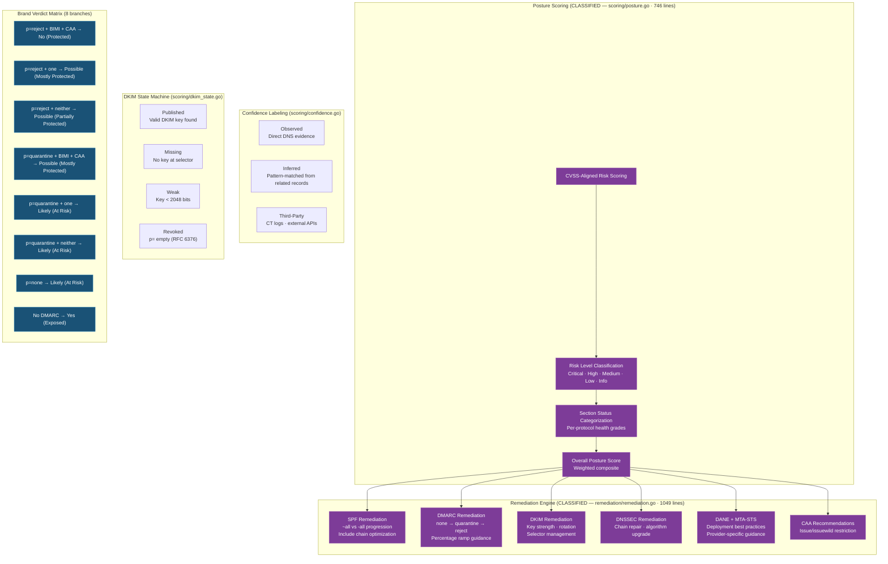
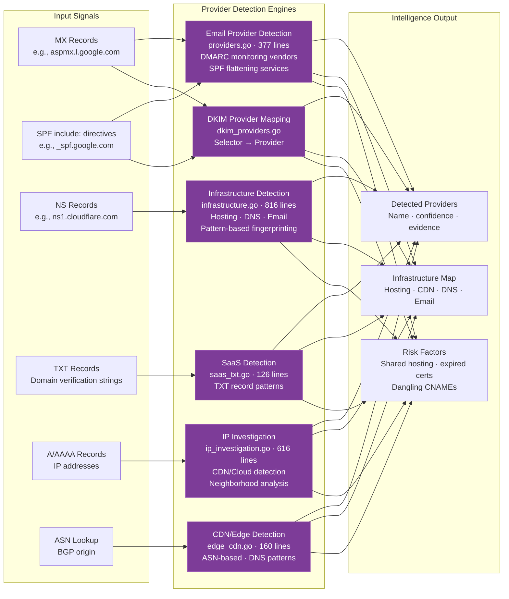
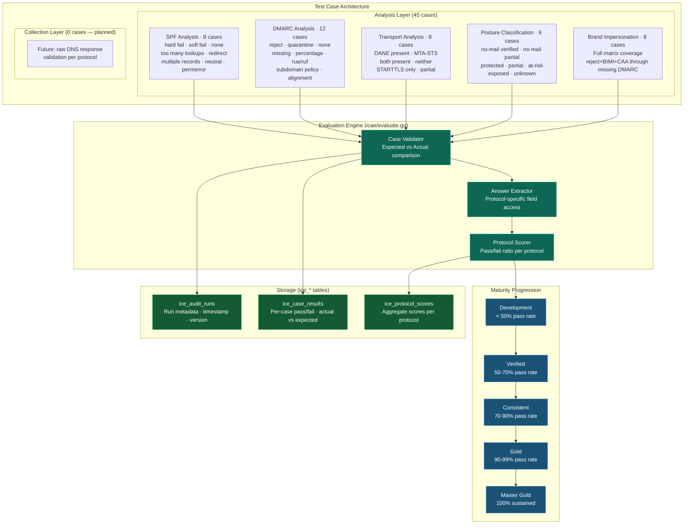
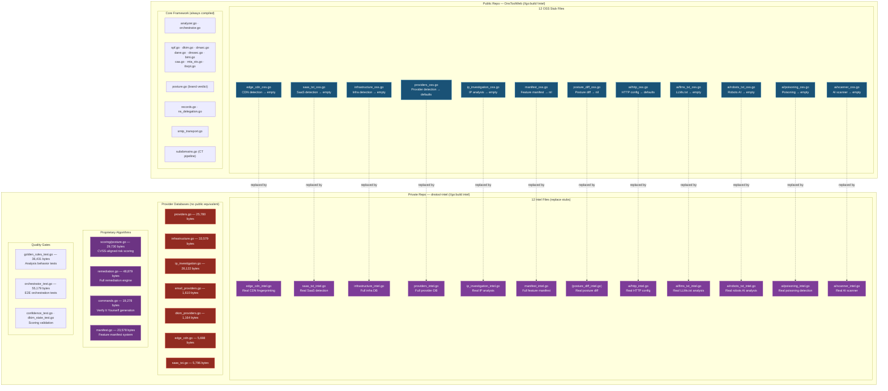
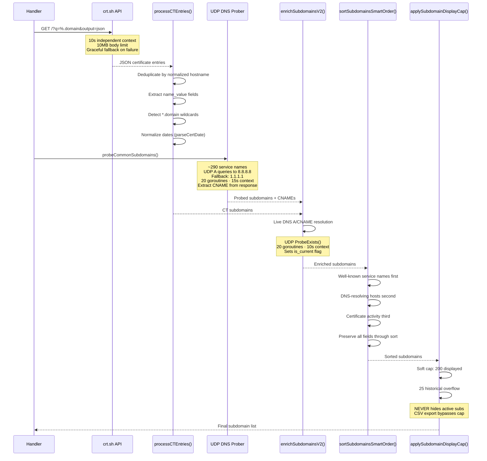
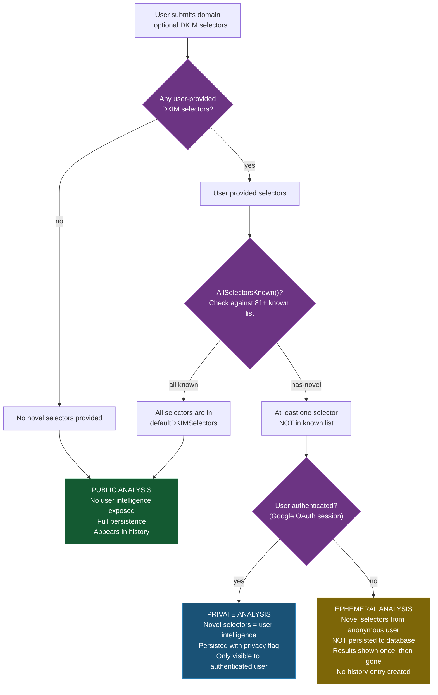

# DNS Tool — Classified Intelligence Architecture

> **CLASSIFICATION: PROPRIETARY — Intel Repo Only**
> This document contains implementation details that MUST NOT appear in the public DnsToolWeb repository.
> The public-facing version is `docs/architecture/SYSTEM_ARCHITECTURE.md` — it shows structural architecture only.
> This classified version shows the full intelligence pipeline, provider databases, scoring algorithms, and methodology.

---

## 1. Complete Intelligence Pipeline (Full Chain)

```mermaid
graph TB
    subgraph "Input Layer"
        Domain["Domain Name"]
        Selectors["User DKIM Selectors"]
        APIKeys["User API Keys<br/>SecurityTrails (50 req/mo)"]
        ZoneFile["Zone File Upload<br/>(ON ROADMAP)"]
    end

    subgraph "Collection Layer — Multi-Source Intelligence"
        direction TB
        subgraph "DNS Resolution (UDP · 4 resolvers)"
            CF["Cloudflare 1.1.1.1"]
            Google["Google 8.8.8.8"]
            Q9["Quad9 9.9.9.9"]
            ODNS["OpenDNS 208.67.222.222"]
        end

        subgraph "Record Types (Full Spectrum)"
            A["A · AAAA"]
            MX["MX"]
            NS["NS"]
            TXT["TXT (SPF · DMARC · DKIM · BIMI · MTA-STS · TLS-RPT)"]
            CAA2["CAA"]
            TLSA["TLSA (DANE)"]
            SOA["SOA"]
            SRV["SRV"]
            CNAME["CNAME chains"]
        end

        subgraph "Active Probing"
            SMTP["SMTP STARTTLS<br/>Port 25 · EHLO · Certificate"]
            MTASTS["MTA-STS Policy Fetch<br/>/.well-known/mta-sts.txt"]
            SecurityTxt["security.txt<br/>/.well-known/security.txt"]
            BIMI3["BIMI VMC<br/>default._bimi TXT"]
        end

        subgraph "Certificate Transparency Pipeline"
            CTFetch["crt.sh PostgreSQL API<br/>10s independent context<br/>10MB body limit"]
            CTProcess["processCTEntries()<br/>Dedup · wildcard detection<br/>date normalization"]
            DNSProbe["probeCommonSubdomains()<br/>~290 service names<br/>20 goroutines · UDP<br/>15s independent context"]
            CNAMEChase["CNAME Chain Traversal<br/>Infrastructure fingerprinting"]
            Enrich["enrichSubdomainsV2()<br/>Live DNS A/CNAME resolution<br/>20 goroutines · 10s context"]
            SmartSort["sortSubdomainsSmartOrder()<br/>Service names first<br/>Then DNS-resolving<br/>Then cert activity"]
            DisplayCap["applySubdomainDisplayCap()<br/>200 display · 25 historical overflow<br/>NEVER hides active subs<br/>CSV export bypasses cap"]
        end
    end

    subgraph "AI Surface Intelligence"
        RobotsTxt["robots.txt AI Crawler Detection<br/>GPTBot · Claude-Web · Bingbot AI<br/>Directive classification"]
        LLMSTxt["llms.txt / llms-full.txt<br/>AI preference signals"]
        Poisoning["AI Recommendation Poisoning<br/>Indicator detection"]
        HTTPConfig["HTTP Client Config<br/>Timeout · headers · TLS"]
        AIScanner["AI Surface Scanner<br/>Orchestrator"]
    end

    subgraph "Provider Fingerprinting (CLASSIFIED)"
        ProviderDB["Provider Database<br/>377 lines · Pattern matching"]
        InfraDB["Infrastructure DB<br/>816 lines · Hosting/DNS/Email"]
        EdgeCDN["Edge/CDN Detection<br/>160 lines · ASN patterns"]
        SaaSTXT["SaaS TXT Detection<br/>126 lines · Domain verification"]
        IPDB["IP Investigation<br/>616 lines · CDN/cloud · neighborhood"]
        DKIMProv["DKIM Provider DB<br/>Selector-to-provider mapping"]
        EmailProv["Email Provider DB<br/>MX/SPF fingerprinting"]
    end

    Domain --> CF & Google & Q9 & ODNS
    CF & Google & Q9 & ODNS --> A & MX & NS & TXT & CAA2 & TLSA & SOA & SRV & CNAME
    Domain --> SMTP & MTASTS & SecurityTxt & BIMI3
    Domain --> CTFetch
    CTFetch --> CTProcess --> DNSProbe --> CNAMEChase --> Enrich --> SmartSort --> DisplayCap
    Domain --> AIScanner --> RobotsTxt & LLMSTxt & Poisoning
    MX & TXT & NS --> ProviderDB & InfraDB & EdgeCDN & SaaSTXT & EmailProv & DKIMProv
    A --> IPDB

    classDef classified fill:#7d3c98,stroke:#9b59b6,color:#fff
    classDef pipeline fill:#1a5276,stroke:#2980b9,color:#fff
    classDef collection fill:#0e6655,stroke:#1abc9c,color:#fff
    class ProviderDB,InfraDB,EdgeCDN,SaaSTXT,IPDB,DKIMProv,EmailProv classified
    class CTFetch,CTProcess,DNSProbe,CNAMEChase,Enrich,SmartSort,DisplayCap pipeline
    class CF,Google,Q9,ODNS collection
```

## 2. ICIE Classification Engine — Full Verdict Logic

## 3. Provider Fingerprinting Chain (CLASSIFIED)

## 4. ICAE Audit Pipeline — Full Detail

## 5. Two-Repo Build Tag Boundary — Full Inventory

## 6. Subdomain Discovery Pipeline — Sequence Detail (CLASSIFIED)

## 7. Privacy Mode Decision Tree

---

*CLASSIFICATION: PROPRIETARY — dnstool-intel repository only*
*Generated for DNS Tool v26.20.73 — February 19, 2026*
*Public version: docs/architecture/SYSTEM_ARCHITECTURE.md (structural only)*
