# DNS Tool — System Architecture

## 1. High-Level System Overview

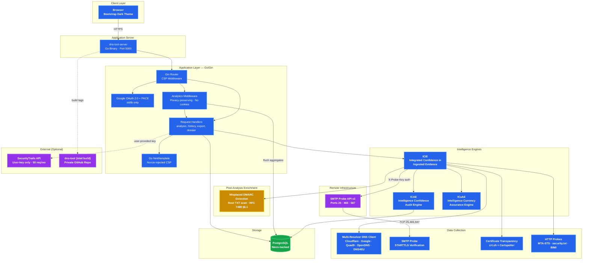

## 2. ICIE — Intelligence Classification & Interpretation Engine

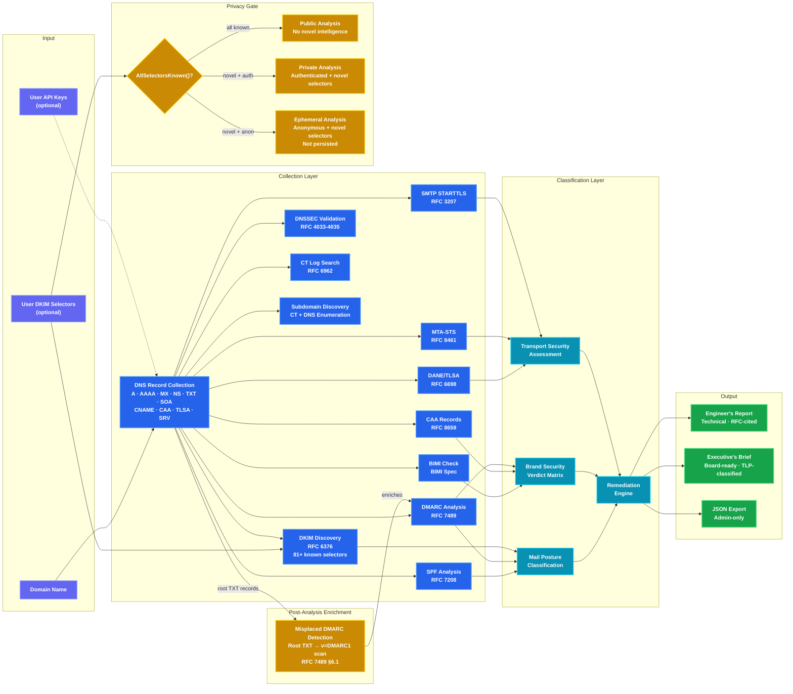

## 3. ICAE — Intelligence Confidence Audit Engine

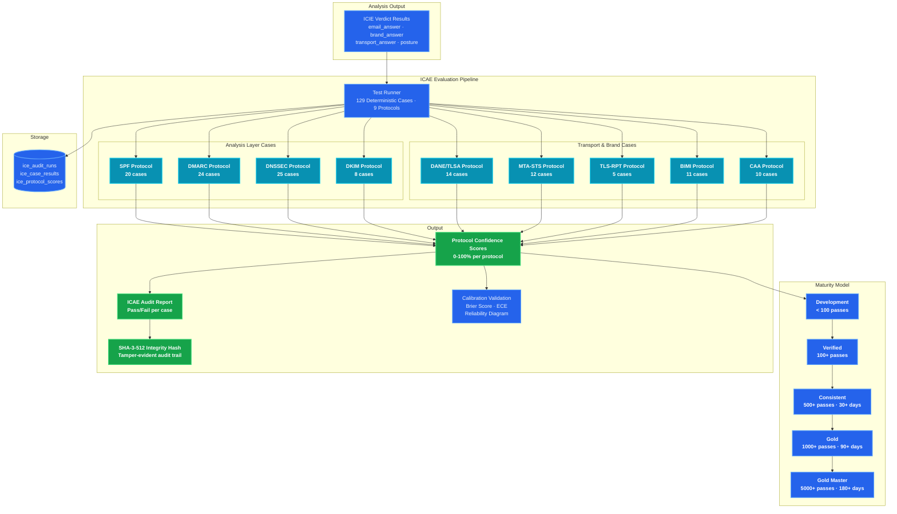

## 4. Two-Repo Open-Core Architecture

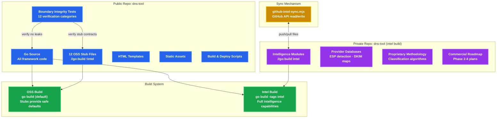

## 5. Email Security Verdict Chain

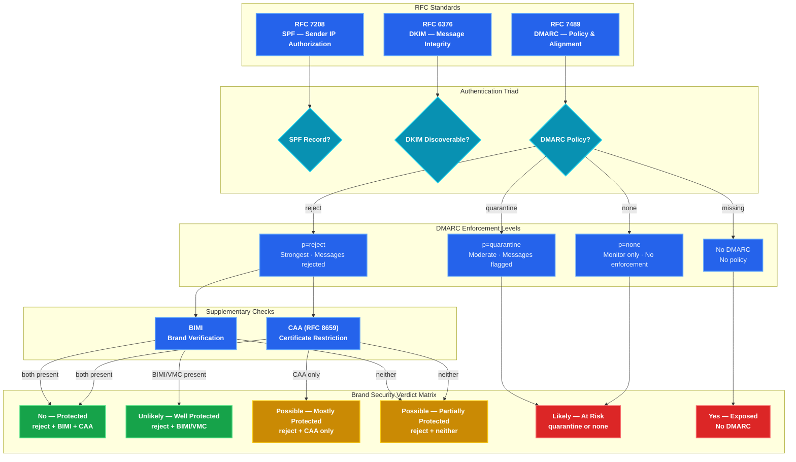

## 6. Misplaced DMARC Record Detection

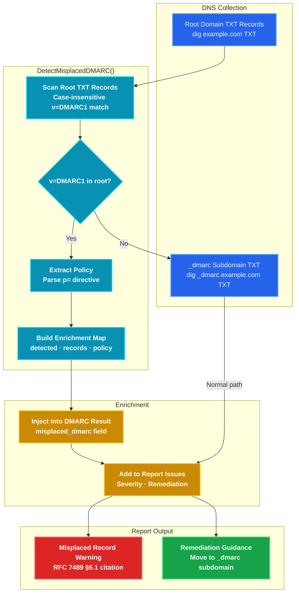

## 7. Request Lifecycle

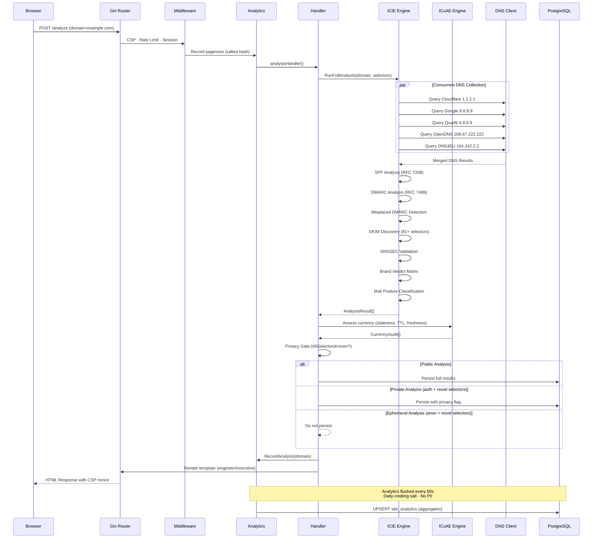

## 8. Package Dependency Map

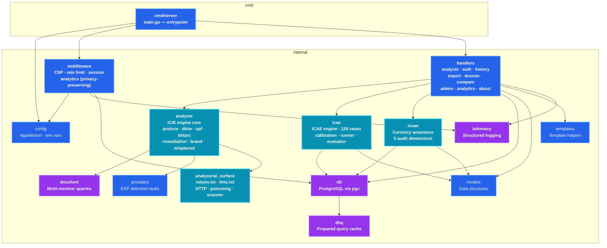

## 9. Distributed Probe Mesh — Future Architecture

The Distributed Probe Mesh extends DNS Tool's multi-vantage intelligence from
dedicated probe nodes to a volunteer network of browser-based DNS probes.

### Design Principles

- **Accuracy first**: Volunteer probes augment but never override trusted anchor nodes
- **Untrusted by default**: All volunteer data treated as untrusted; consensus is mathematically enforced
- **Privacy-preserving**: Blinded work queues, batched queries, ephemeral session IDs, no PII

### Consensus Model

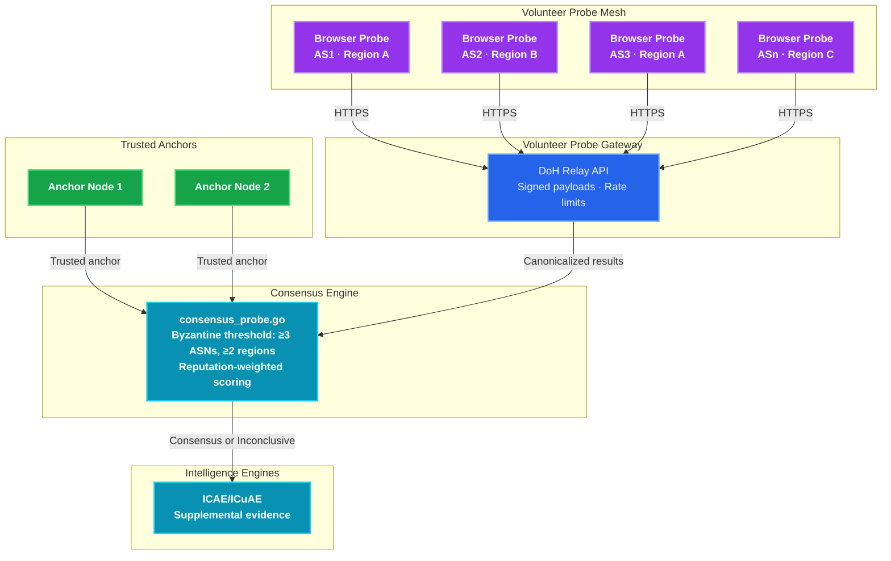

### Phased Rollout

| Phase | Scope |
|-------|-------|
| **MVP** | Standalone DoH relay + web widget. A/AAAA/NS/MX/TXT queries. Per-probe metadata. |
| **Beta** | Consensus engine, ASN/geo diversity scoring, anomaly flags, volunteer badges. |
| **Production** | Reputation system, fraud detection, blinded task queues, browser extension, API for self-hosted nodes. |

### Community Model — Good Net Citizens

Volunteers contribute multi-vantage DNS intelligence as OSINT officers,
strengthening the public pool of infrastructure intelligence. Tiers:

- **Widget** — One-click browser participation (lightweight, privacy notice)
- **Extension** — Persistent probe node via browser extension
- **Self-Hosted** — API for power users running signed probe nodes

## 10. Encrypted DNS Transport Detection

DNS Tool will probe whether domains support encrypted DNS transports:

- **DoH** (DNS-over-HTTPS, RFC 8484) — HTTPS endpoint discovery via `.well-known/dns-query` and SVCB/HTTPS records
- **DoT** (DNS-over-TLS, RFC 7858) — TCP/853 connectivity and certificate validation
- **DDR** (Discovery of Designated Resolvers, RFC 9462) — SVCB `_dns.resolver.arpa` record detection

These complement the existing protocol analysis (SPF, DKIM, DMARC, DANE, DNSSEC,
CAA, MTA-STS, TLS-RPT, BIMI) and map to the DNS Engineer archetype's RFC-grounded
posture assessment.

---

## 11. Drift Engine — Posture Change Detection

The drift engine detects DNS posture changes between analyses, enabling continuous security monitoring.

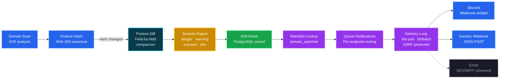

### Key Components

| Component | File | Purpose |
|-----------|------|---------|
| Posture Hash | `posture_hash.go` | Canonical SHA-256 hash of analysis results |
| Posture Diff | `posture_diff.go` | Structured field-by-field comparison |
| Severity Classification | `posture_diff_oss.go` | Maps changes to Bootstrap severity classes |
| Drift Persistence | `analysis.go` | `persistDriftEvent()` creates drift events |
| Notification Queuing | `analysis.go` | `queueDriftNotifications()` routes to watchlist watchers |
| Delivery Loop | `main.go` | `startNotificationDelivery()` — 30s poll, 50/batch |
| SSRF Protection | `notifier.go` | `isSSRFSafe()` blocks private/loopback IPs |

### Drift Severity Rules (OSS Defaults)

- DMARC policy downgrade (reject → none): `danger`
- DMARC policy upgrade (none → reject): `success`
- Security status degradation (pass → fail): `danger`
- Security status improvement (fail → pass): `success`
- MX/NS record changes: `warning`
- Other changes: `info`

## 12. GitHub Issues Triage — Three-Tier Intelligence Routing

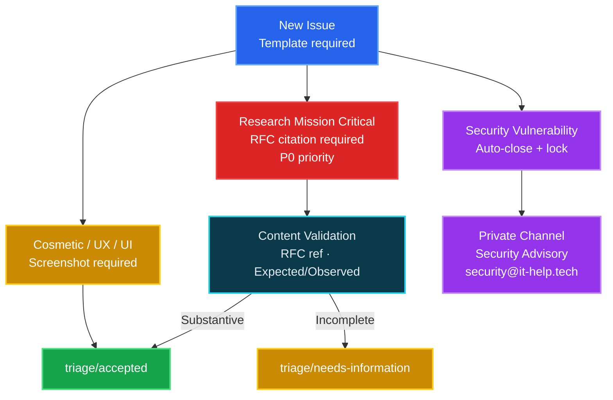

### Triage Categories

| Category | Priority | Automation | Examples |
|----------|----------|------------|---------|
| Research Mission Critical | P0 — Immediate | Validates RFC references, checks substantive content | Wrong RFC citation, flawed confidence logic, broken detection vector |
| Cosmetic / UX / UI | Normal cadence | Auto-acknowledge, version/device tracking | Layout bugs, accessibility issues, visual polish |
| Security Vulnerability | Private only | Auto-close, lock, redirect to advisory | Vulnerabilities, exploits, security flaws |

### Automated Safeguards

- **Blank issues disabled** — all reporters must choose a template
- **Duplicate check** — required checkbox: "I have searched existing issues"
- **Security keyword scanner** — detects vulnerability-related terms in non-security issues, flags for review
- **Idempotent comments** — bot markers prevent duplicate acknowledgments on edits
- **Label state machine** — `needs-triage` → `triage/accepted` or `triage/needs-information`

---

*Generated for DNS Tool v26.34.54 — March 6, 2026*
*Diagrams render natively on GitHub, GitLab, and VS Code with Mermaid plugins.*
